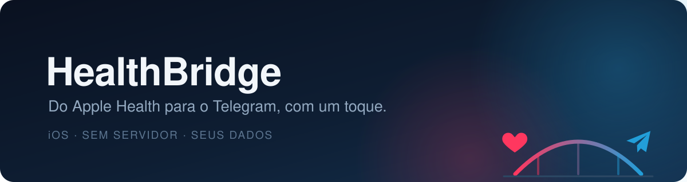

<p align="center">
  
</p>

<p align="center">
  <b>From Apple Health to Telegram, with one tap.</b><br>
  A personal iPhone app · no server · your bot, your data
</p>

<p align="center">
  
  
  
  
</p>

<p align="center">
  <a href="#-what-it-is">What it is</a> ·
  <a href="#-what-the-app-does">What it does</a> ·
  <a href="#-what-the-app-does-not-do">What it doesn't do</a> ·
  <a href="#-how-to-report-a-problem-or-suggest-something">How to report</a> ·
  <a href="#️-how-to-follow-your-request">Follow your request</a> ·
  <a href="#-privacy">Privacy</a>
</p>

---

## 👋 Welcome

This is the **public mirror of HealthBridge** — the open channel where you report bugs, ask questions and suggest improvements.

> **The source code is not here.** This repository exists for one thing only: talking to the people who use the app. Every issue opened here is read, triaged and answered.

<p align="center">
  <a href="https://github.com/fabricio-entringer/health-bridge-public/issues/new/choose"><b>🐞 Report a problem</b></a> ·
  <a href="https://github.com/fabricio-entringer/health-bridge-public/issues"><b>📋 See what's already been reported</b></a>
</p>

🌍 **Write in whichever language you prefer.** The app speaks several languages, and so does this channel — you'll get an answer in the same language you wrote in.

---

## 🩺 What it is

**HealthBridge** is an iPhone app that reads the **Apple Health** metrics you authorize — steps, heart rate, weight, active energy and others — and sends them to one or more **Telegram channels or groups**, using **your own bot**.

No server, no backend, no cloud in between: the app talks straight to Telegram from your iPhone.

```
🍎 Apple Health  →  📱 HealthBridge  →  ✈️ Telegram
   (only what          (one tap on         (the channels
    you authorize)      the Send button)     you set up)
```

It's a **personal** app, distributed through TestFlight/sideload. It isn't on the App Store, it isn't multi-user, and it collects nothing about you.

---

## ✨ What the app does

| | |
|---|---|
| ✈️ **One-tap sending** | One screen, one button, per-channel result right away. |
| 🎯 **You pick the metrics** | Type by type. The app only reads what Apple Health authorized. |
| 📡 **Several channels at once** | The same report goes to every destination you set up. |
| 🧯 **Isolated failures** | If one channel fails, the others still receive it — and the reason is recorded. |
| 🗒️ **History** | One entry per send, with date, metrics and the status of each channel. |
| 🔑 **Protected token** | Your bot token is stored securely on the iPhone and never shown back to you. |
| ✍️ **Your own wording** | Intro text, mention and format (text, Markdown or JSON) configurable per channel. |
| 📅 **Send period** | Today, a specific day, or a date range. |

---

## 🚫 What the app does **not** do

These are deliberate product decisions, not missing pieces. Knowing them upfront saves you time:

- **No Android version.** It's an iOS app, and that isn't expected to change.
- **Not on the App Store.** Distribution is personal, through TestFlight/sideload.
- **Not multi-user.** No accounts, no login, no separate profiles.
- **No server of ours.** None of your data passes through any infrastructure of ours — because there isn't any.
- **No sending on a schedule.** Sending is always manual, started by you.
- **No in-app charts or CSV export.** The app sends and records; the analysis happens at the destination, with you.
- **Nothing is written back to Apple Health.** The permission is read-only.

A request that runs into one of these usually gets declined — but **always with a concrete explanation**, never a bare "out of scope". And some topics do evolve: if your case sits on the border, it gets marked for review instead of being closed on the spot.

---

## 🐞 How to report a problem or suggest something

The quickest way is **from inside the app**, which fills in the version and the template for you. If you'd rather do it here, [open an issue](https://github.com/fabricio-entringer/health-bridge-public/issues/new/choose) — in any language.

<details>
<summary><b>What makes a good bug report</b> (click to open)</summary>

<br>

1. **What you did** — the steps, in order.
2. **What happened** — the behaviour you saw.
3. **What you expected** — how it should have gone.
4. **App and iOS version** — the app fills these in automatically when the report is sent from inside it.
5. **A screenshot or video**, if you can. It's worth a lot for anything visual.

⚠️ **Before attaching a screenshot:** check that it doesn't show your bot token, the `chat id` of your channels, or health data you'd rather not make public. This repository is open — anyone can read what you post here.

</details>

<details>
<summary><b>What makes a good suggestion</b> (click to open)</summary>

<br>

1. **The problem, not the solution.** "I waste time checking whether I already sent today" goes further than "add a green badge at the top".
2. **When it gets in your way** — how often, in what situation.
3. **How you work around it today**, if you do.

A well-described suggestion can be accepted even when the final solution ends up different from the one you had in mind.

</details>

**Before opening one:** have a look at the [existing issues](https://github.com/fabricio-entringer/health-bridge-public/issues). If someone already reported the same thing, commenting there helps more than opening another — repeated requests get grouped into a single issue.

---

## 🏷️ How to follow your request

Every issue gets labels that tell you where it stands, without you having to ask.

**Triage decision**

| Label | What it means |
|---|---|
| `triage: pending` | Not reviewed yet. |
| `triage: accepted` | Accepted. It's in the work queue. |
| `triage: needs-info` | Something is missing before a decision can be made — the ball is with you. |
| `triage: under-review` | A borderline case, being evaluated. |
| `triage: duplicate` | There's already an issue about this; the conversation was centralised there. |
| `triage: out-of-scope` | It won't be done, with the reason explained in a comment. |

**Progress (on accepted ones)**

| Label | What it means |
|---|---|
| `status: queued` | In the queue. |
| `status: in-progress` | Out of the queue and being worked on. |
| `status: shipped` | Delivered — you're told in the issue itself, along with the version it's available in. |
| `status: closed-unresolved` | Closed without delivery, with an explanation of the outcome. |

---

## 🤝 What you can expect

- **Every issue is read and answered.** None of them disappear in silence.
- **A decline comes with a concrete reason** and, when there is one, an alternative.
- **We never promise dates.** "Accepted and queued" is the most that can be said honestly.
- **When it ships, you'll know** — in the issue itself, with what changed and which version has it.
- **If the problem comes back, reopen it.** A closed issue isn't a closed subject.

---

## 🔒 Privacy

- The app reads **only** the metric types you authorize, one by one, and **never writes** to Apple Health.
- The **only network destination** is the Telegram API, talking to **your bot**, for **your channels**.
- **Zero** analytics, telemetry or third-party services.
- Your bot token is stored securely on the iPhone — it doesn't go to backups or to the cloud, and there's no way to display or export it.

---

## 🌍 Em português

O **HealthBridge** é um app de iPhone que lê as métricas do Apple Health que você autorizar e as envia, sob demanda e com um toque, para os seus canais do Telegram, usando o seu próprio bot. Sem servidor, sem backend, sem terceiros no meio.

Este repositório é o **espelho público**: o código-fonte não fica aqui, mas relatos de bug, dúvidas e sugestões são muito bem-vindos. Pode [abrir uma issue](https://github.com/fabricio-entringer/health-bridge-public/issues/new/choose) em português — o formulário está em inglês, mas você escreve no seu idioma e a resposta vem no mesmo.

---

<p align="center">
  <sub>A personal project by <a href="https://entringer.dev">Fabrício Entringer</a> · internal use, not distributed on the App Store</sub>
</p>
